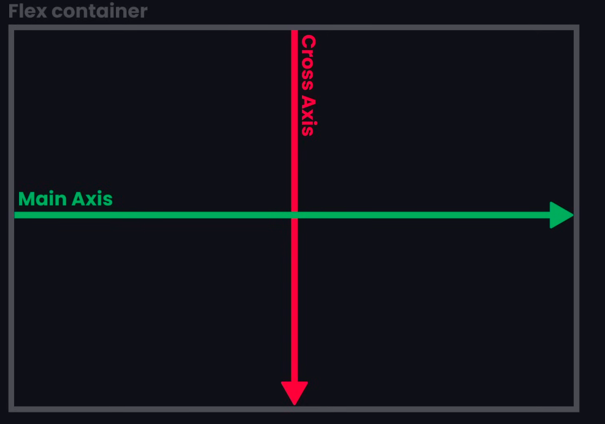

# 1. display: flex;
=> Or we can say flexible container is applied to parent element to stack child items

=> Most elements have a display of block or inline by default

=> Display : block force elements to take whole line, which forces element to the next line

# 2. Axis of a flex:
Main Axis -> horizontal

Cross Axis -> vertical

To put the content on the Main axis, we need to use the property 

justify-content: flex-start

### Below are some other values for justify-content

justify-content: space-evenly;

justify-content: space-around;

justify-content: space-between;

justify-content: center;

justify-content: flex-end;

To put the content on the Cross axis (vertically), we need to use the property 

align-items

align-items: flex-start;

and you may check other properties as well