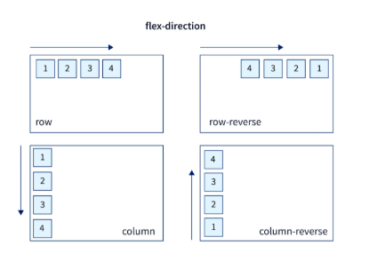

# 1. flex-direction;

flex-direction controls the direction of the main (horizontal) axis

flex-direction: row-reverse; to stack the items in reverse order and also stacked to the right
 
by default the flex-direction is row

flex-direction: column; will stack the items vertically 

