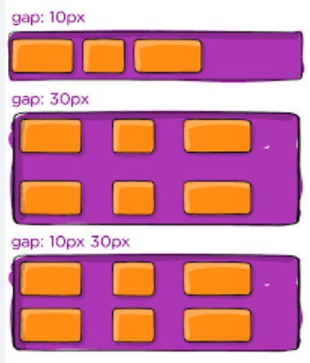
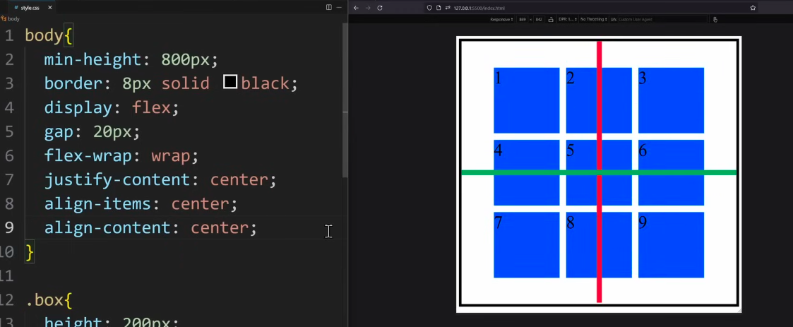

# 1. gap:

Gap is used to control the space between flex items without adding margins to individual items.

## example

 .container {
  display: flex;
  gap: 16px;
}

=> Another types of gap

row-gap:10px

column-gap: 10px

or

gap: 20px; this means row and column both

# 2. flex-wrap :

flex-wrap: wrap;

flex wrap makes the flex box responsive, i.e item stack on the next line on smaller screens

## flex-wrap other values : 

nowrap 

wrap 

wrap-reverse

# Gap example :

# Placing square boxes in center

we need to use two more properties along with gap, flex-wrap:wrap, justify-content:center that are align-items: center; and align-content: center;

just like below : 

