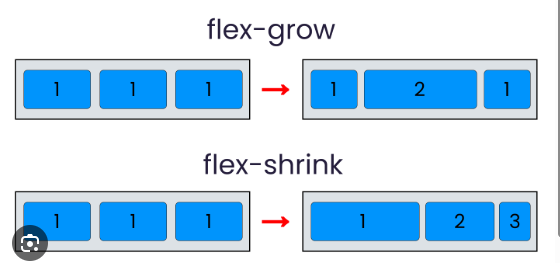
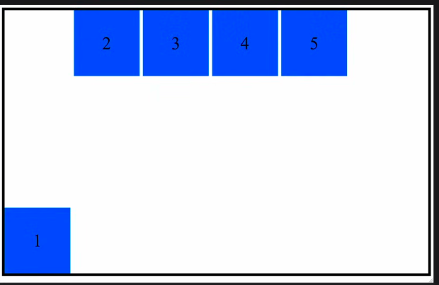

# 1. gap:

Gap is used to control the space between flex items without adding margins to individual items.

## example

 .container {
  display: flex;
  gap: 16px;
}

=> Another types of gap

row-gap:10px

column-gap: 10px

or

gap: 20px; this means row and column both

# 2. flex-wrap :

flex-wrap: wrap;

flex wrap makes the flex box responsive, i.e item stack on the next line on smaller screens

## flex-wrap other values : 

nowrap 

wrap 

wrap-reverse

# Gap example :

# Placing square boxes in center

we need to use two more properties along with gap, flex-wrap:wrap, justify-content:center that are align-items: center; and align-content: center;

just like below : 

# 3. Flex Shrink 

flex-shrink:0; will make the elements non responsive, meaning they will not resize as the screen size decreases

flex-shrink:1; will make the elements responsive,

so, it's bacically like on and off

=> we can also make one the element non shrinkable by giving flex-shrink:0 to that particular element, sometimes usefull

# 4. Flex-grow

=> elements will grow in size with the screen size increasing
=> In this, items try to take the full available space
=> By default, the flex-grow value is 0

the values of flex-shrink and flex-grow are basically the multipliers, so they will grow or shrink according to the multiplier

The flex-grow or shrink are mostly used in a combination with max or min width so that we can stop them to grow or shrink at 
some particular point

For the flex-shrink we also have another combination which is flex-wrap, that is mostly used to do wrapping after reaching a 
certain screen size

example: 

@media(max-width: 575px) {
    body {
        flex-wrap: wrap;
    }
}

# 5. Align self

Align a single element differently

example below 

